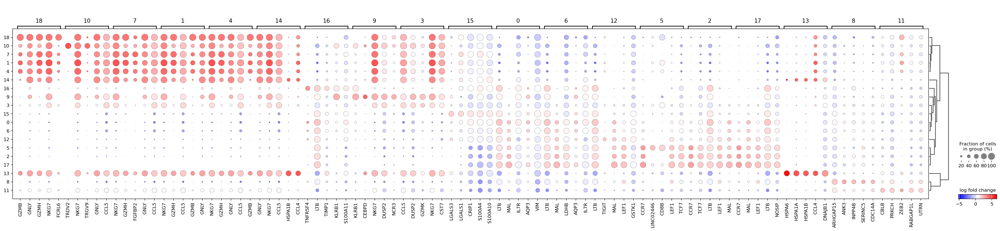

# scVI_de

While not extensive, in my testing so far I've found the DEG analysis functions provided by 
[scVI](https://docs.scvi-tools.org/en/stable/user_guide/models/scvi.html) to be much better at picking up things that actually differentate clusters and not just returning a list of ribosomal proteins. There is a 
[tutorial](https://docs.scvi-tools.org/en/stable/tutorials/notebooks/scrna/scVI_DE_worm.html) for using scVI to perform 
differential expression analysis in their repository of guides, but repeatedly following those steps is a bit more 
complicated and a bit more to remember than simply running `scanpy.tl.rank_genes_groups`, so I've tried to wrap 
everything into a much simpler function.  Additionally, I've added functionality to perform the same analysis on 
protein (i.e. CITE-seq) data using [TotalVI](https://docs.scvi-tools.org/en/stable/user_guide/models/totalvi.html) and 
will hopefully get to ATAC-seq data soon.

# Installation

For the moment, this package is only available on github. Install using pip:

```bash
pip install git+https://github.com/milescsmith/scvi_de
```

## Requirements

`scvi_de` requires Python 3.10 or greater as well as (obviously) [scVI](https://scvi-tools.org/).

While a GPU is not strictly *required*, its use will dramatically improve the speed of analysis. Due to the model building
performed by scVI and TotalVI, running `scvi_de` is substantially slower than `scanpy.tl.rank_genes_groups`

# Use

As part of [scverse](https://scverse.org/), scVI is designed to work on [AnnData](https://github.com/scverse/anndata); 
additionally, both scVI and TotalVI require raw, unnormalized integer counts for RNA-seq or CITE-seq data, respectively,
which should appear like:

```python
matrix([[1., 6., 0., 0., 0.],
        [0., 0., 0., 8., 0.],
        [3., 0., 0., 0., 20.],
        [0., 0., 4., 0., 0.],
        [0., 17., 0., 9., 0.]], dtype=float32)
```

If the integer counts are present in a layer, `scvi_de` *should* be able use the counts from there (though, I've 
repeatedly had issues with making sure that does work and really need to write some unit tests to make sure that isn't 
a problem.)  If the counts are present in `adata.X`, there should be no issue.

Presuming the data has been processed and there are clusters for which you'd like to find markers, run:

```python
import scanpy as sc
from scvi_de import scvi_de

adata = sc.read_h5ad("adata_file.h5ad")

# run if counts are not in X but are present in a layer:
# adata.layer["norm"] = adata.X.copy()
# adata.X = adata.layer["counts"].copy()

degs = scvi_de(
    adata=adata,
    groupby="leiden",
    modality="rna",
    return_df=True,
    return_model=True,
    dispersion="gene-batch",
    gene_likelihood="zinb",
)
```

By default, the function should return:
* an adata object
* a dictionary of dataframes, with one dataframe for each comparison
* the model that was generated (or used). this can be used in further runs of `scvi_de`

The returned adata object will have the DEG results placed in adata.obs["rank_genes_groups"] just like 
`scanpy.tl.rank_genes_groups()`

If `return_df` is `True`, `scvi_de` will return a dictionary with a dataframe for each group comparison:


```python
degs['deg_df'].keys()
```
> dict_keys(['9', '3', '1', '0', '4', '2', '11', '5', '8', '12', '7', '6', '10', '14', '13', '15', '18', '16', '17'])

```python
df = degs['deg_df']['1']
```
where the dataframe is in the form:
```python
df.head()
```

<div>
<style scoped>
    .dataframe tbody tr th:only-of-type {
        vertical-align: middle;
    }

    .dataframe tbody tr th {
        vertical-align: top;
    }

    .dataframe thead th {
        text-align: right;
    }
</style>
<table border="1" class="dataframe">
  <thead>
    <tr style="text-align: right;">
      <th></th>
      <th>proba_de</th>
      <th>proba_not_de</th>
      <th>bayes_factor</th>
      <th>scale1</th>
      <th>scale2</th>
      <th>pseudocounts</th>
      <th>delta</th>
      <th>lfc_mean</th>
      <th>lfc_median</th>
      <th>lfc_std</th>
      <th>lfc_min</th>
      <th>lfc_max</th>
      <th>raw_mean1</th>
      <th>raw_mean2</th>
      <th>non_zeros_proportion1</th>
      <th>non_zeros_proportion2</th>
      <th>raw_normalized_mean1</th>
      <th>raw_normalized_mean2</th>
      <th>is_de_fdr_0.05</th>
    </tr>
  </thead>
  <tbody>
    <tr>
      <th>PASK</th>
      <td>0.9714</td>
      <td>0.0286</td>
      <td>3.525331</td>
      <td>0.000020</td>
      <td>0.000156</td>
      <td>0.0</td>
      <td>0.25</td>
      <td>-2.795641</td>
      <td>-3.112103</td>
      <td>2.620477</td>
      <td>-10.014138</td>
      <td>6.946982</td>
      <td>0.024429</td>
      <td>0.169130</td>
      <td>0.022305</td>
      <td>0.119732</td>
      <td>0.165551</td>
      <td>1.227632</td>
      <td>True</td>
    </tr>
    <tr>
      <th>AQP3</th>
      <td>0.9704</td>
      <td>0.0296</td>
      <td>3.489934</td>
      <td>0.000036</td>
      <td>0.000303</td>
      <td>0.0</td>
      <td>0.25</td>
      <td>-2.967551</td>
      <td>-3.187868</td>
      <td>2.125046</td>
      <td>-9.186669</td>
      <td>6.896668</td>
      <td>0.022305</td>
      <td>0.398442</td>
      <td>0.021243</td>
      <td>0.251156</td>
      <td>0.163711</td>
      <td>2.854752</td>
      <td>True</td>
    </tr>
    <tr>
      <th>PRSS23</th>
      <td>0.9696</td>
      <td>0.0304</td>
      <td>3.462441</td>
      <td>0.000215</td>
      <td>0.000052</td>
      <td>0.0</td>
      <td>0.25</td>
      <td>5.040472</td>
      <td>5.561466</td>
      <td>3.781550</td>
      <td>-8.837938</td>
      <td>15.489596</td>
      <td>0.309081</td>
      <td>0.060545</td>
      <td>0.231014</td>
      <td>0.046950</td>
      <td>2.213014</td>
      <td>0.480922</td>
      <td>True</td>
    </tr>
    <tr>
      <th>CCR7</th>
      <td>0.9666</td>
      <td>0.0334</td>
      <td>3.365229</td>
      <td>0.000046</td>
      <td>0.000388</td>
      <td>0.0</td>
      <td>0.25</td>
      <td>-3.046691</td>
      <td>-3.309097</td>
      <td>2.612986</td>
      <td>-9.117955</td>
      <td>7.211918</td>
      <td>0.012746</td>
      <td>0.484909</td>
      <td>0.010621</td>
      <td>0.259947</td>
      <td>0.096357</td>
      <td>3.553638</td>
      <td>True</td>
    </tr>
    <tr>
      <th>FGFBP2</th>
      <td>0.9664</td>
      <td>0.0336</td>
      <td>3.359051</td>
      <td>0.001450</td>
      <td>0.000410</td>
      <td>0.0</td>
      <td>0.25</td>
      <td>3.991240</td>
      <td>4.324495</td>
      <td>3.047870</td>
      <td>-5.922016</td>
      <td>12.854061</td>
      <td>1.719606</td>
      <td>0.405058</td>
      <td>0.592140</td>
      <td>0.143660</td>
      <td>12.805597</td>
      <td>3.320689</td>
      <td>True</td>
    </tr>
  </tbody>
</table>
</div>


The important columns are:
* `proba_de` - probability that the feature *is* differentially expressed
* `proba_not_de` - probability that the feature *is* **NOT** differentially expressed. This is essentially the adjusted p-value.
* `lfc_mean` - Mean log-fold change for the group.
* `non_zeros_proportion1` - proportion of zero values for cells *in* the group of interest
* `non_zeros_proportion2` - proportion of zero values for cells *outside* the group of interest
* `is_de_fdr_0.05` - is the feature significantly differently expressed?

We can look at the top 5 significant DEGs expressed in over 50% of the cells in cluster 1, sorted by log-fold change:


```python
df[(df["proba_de"] > 0.95) & (df["non_zeros_proportion1"] > 0.5)].sort_values(by="lfc_mean", ascending=False).head()
```


<div>
<style scoped>
    .dataframe tbody tr th:only-of-type {
        vertical-align: middle;
    }

    .dataframe tbody tr th {
        vertical-align: top;
    }

    .dataframe thead th {
        text-align: right;
    }
</style>
<table border="1" class="dataframe">
  <thead>
    <tr style="text-align: right;">
      <th></th>
      <th>proba_de</th>
      <th>proba_not_de</th>
      <th>bayes_factor</th>
      <th>scale1</th>
      <th>scale2</th>
      <th>pseudocounts</th>
      <th>delta</th>
      <th>lfc_mean</th>
      <th>lfc_median</th>
      <th>lfc_std</th>
      <th>lfc_min</th>
      <th>lfc_max</th>
      <th>raw_mean1</th>
      <th>raw_mean2</th>
      <th>non_zeros_proportion1</th>
      <th>non_zeros_proportion2</th>
      <th>raw_normalized_mean1</th>
      <th>raw_normalized_mean2</th>
      <th>is_de_fdr_0.05</th>
    </tr>
  </thead>
  <tbody>
    <tr>
      <th>GZMH</th>
      <td>0.9562</td>
      <td>0.0438</td>
      <td>3.083333</td>
      <td>0.003043</td>
      <td>0.000735</td>
      <td>0.0</td>
      <td>0.25</td>
      <td>4.363708</td>
      <td>4.739703</td>
      <td>3.026137</td>
      <td>-4.632605</td>
      <td>13.204952</td>
      <td>4.048316</td>
      <td>0.767610</td>
      <td>0.859267</td>
      <td>0.198677</td>
      <td>29.876085</td>
      <td>6.347984</td>
      <td>True</td>
    </tr>
    <tr>
      <th>CCL4</th>
      <td>0.9558</td>
      <td>0.0442</td>
      <td>3.073824</td>
      <td>0.001034</td>
      <td>0.000309</td>
      <td>0.0</td>
      <td>0.25</td>
      <td>4.289329</td>
      <td>4.465241</td>
      <td>3.459160</td>
      <td>-4.822578</td>
      <td>15.601782</td>
      <td>1.258106</td>
      <td>0.305540</td>
      <td>0.509825</td>
      <td>0.121998</td>
      <td>9.876792</td>
      <td>2.731168</td>
      <td>True</td>
    </tr>
    <tr>
      <th>GZMB</th>
      <td>0.9652</td>
      <td>0.0348</td>
      <td>3.322718</td>
      <td>0.001501</td>
      <td>0.000384</td>
      <td>0.0</td>
      <td>0.25</td>
      <td>4.179798</td>
      <td>4.621313</td>
      <td>2.995448</td>
      <td>-5.492234</td>
      <td>12.466099</td>
      <td>1.853437</td>
      <td>0.360193</td>
      <td>0.619225</td>
      <td>0.128342</td>
      <td>13.428296</td>
      <td>2.975245</td>
      <td>True</td>
    </tr>
    <tr>
      <th>FGFBP2</th>
      <td>0.9664</td>
      <td>0.0336</td>
      <td>3.359051</td>
      <td>0.001450</td>
      <td>0.000410</td>
      <td>0.0</td>
      <td>0.25</td>
      <td>3.991240</td>
      <td>4.324495</td>
      <td>3.047870</td>
      <td>-5.922016</td>
      <td>12.854061</td>
      <td>1.719606</td>
      <td>0.405058</td>
      <td>0.592140</td>
      <td>0.143660</td>
      <td>12.805597</td>
      <td>3.320689</td>
      <td>True</td>
    </tr>
    <tr>
      <th>PRF1</th>
      <td>0.9576</td>
      <td>0.0424</td>
      <td>3.117282</td>
      <td>0.001072</td>
      <td>0.000346</td>
      <td>0.0</td>
      <td>0.25</td>
      <td>2.882605</td>
      <td>3.079802</td>
      <td>2.438780</td>
      <td>-4.997347</td>
      <td>11.074460</td>
      <td>1.479563</td>
      <td>0.399710</td>
      <td>0.597982</td>
      <td>0.193148</td>
      <td>9.761561</td>
      <td>2.973424</td>
      <td>True</td>
    </tr>
  </tbody>
</table>
</div>


The adata object has the differential expression results stored in `adata.uns`, just like if you ran `sc.tl.rank_genes_groups`, so it can be used to plot with `sc.pl.rank_genes_groups_dotplot`:


```python
sc.pl.rank_genes_groups_dotplot(
    degs['adata'],
    n_genes=5,
    groupby="leiden",
    values_to_plot="logfoldchanges",
    standard_scale='var',
    cmap='bwr',
)
```
    

    
If `return_model` is `True`, the model generated will also be returned and can be used is subsequent analyses of the 
same data but for different comaprisons (e.g. run a 1 vs rest comparison for each cluster, then reuse the model to run
a cluster vs. cluster comparison).